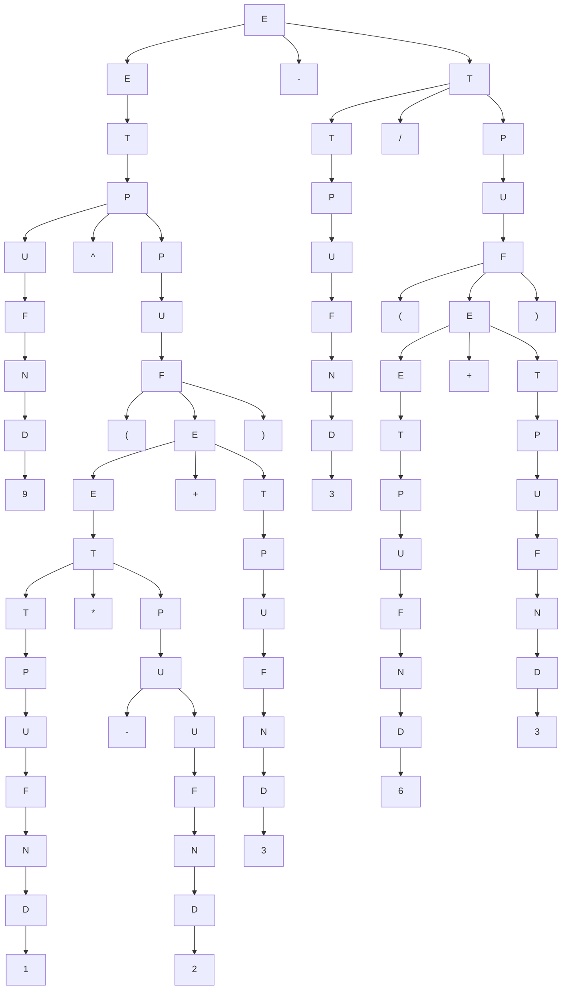

# Reconhecedor de Expressões Aritméticas

## Parte 1 - Entrega da Gramática

Este projeto implementa reconhecedores sintáticos para expressões matemáticas simples.

As operações reconhecidas são:

- número;
- negação unária (positivo<->negativo / verdadeiro<->falso);
- parênteses;
- potência;
- soma;
- subtração;
- multiplicação;
- divisão.

O objetivo do reconhecedor é verificar se uma expressão matemática é válida de acordo com a gramática definida.

Não é necessário calcular o resultado da expressão.

Foram desenvolvidas duas gramáticas:

- Gramática livre de contexto sem forma normal, utilizada no parser de Earley;
- Gramática na Forma Normal de Chomsky, utilizada no parser CYK.

---

# 1. Gramática Livre de Contexto sem Forma Normal

Esta gramática é utilizada pelo parser de Earley.

## 1.1 Terminais

Os terminais da gramática são:

```txt
0 1 2 3 4 5 6 7 8 9
+ - * / ^ ( )
```

## 1.2 Não-terminais

Os não-terminais da gramática são:

```txt
E, T, P, U, F, N, D
```

Onde:

```txt
E = Expressão
T = Termo
P = Potência
U = Unário
F = Fator
N = Número
D = Dígito
```

## 1.3 Símbolo inicial

O símbolo inicial da gramática é:

```txt
E
```

## 1.4 Regras da gramática

```txt
E -> E + T
E -> E - T
E -> T

T -> T * P
T -> T / P
T -> P

P -> U ^ P
P -> U

U -> - U
U -> F

F -> ( E )
F -> N

N -> D N
N -> D

D -> 0
D -> 1
D -> 2
D -> 3
D -> 4
D -> 5
D -> 6
D -> 7
D -> 8
D -> 9
```

## 1.5 Precedência das operações

A precedência das operações é definida pela hierarquia dos não-terminais.

```txt
F -> Parênteses e números
U -> Negação unária
P -> Potência
T -> Multiplicação e divisão
E -> Soma e subtração
```

Dessa forma, as expressões entre parênteses e os números são reconhecidos primeiro.  
Depois são reconhecidos a negação unária, a potência, a multiplicação e divisão e por último, a soma e subtração.

## 1.6 Associatividade

A soma, subtração, multiplicação e divisão possuem associatividade à esquerda, pois são definidas com recursão à esquerda:

```txt
E -> E + T
E -> E - T
T -> T * P
T -> T / P
```

A potência possui associatividade à direita, pois é definida pela regra:

```txt
P -> U ^ P
```

## 1.7 Números sem limite de tamanho

A gramática permite números com um ou mais dígitos por meio das regras:

```txt
N -> D N
N -> D
```

Como `N` pode gerar um dígito seguido de outro número, não há limite fixo para o tamanho do número.

Exemplos de números aceitos:

```txt
5
56
123
9999
```

---

# 2. Gramática na Forma Normal de Chomsky

Esta gramática é utilizada pelo parser CYK.

No parser CYK, números inteiros são tokenizados como `NUM`.  
Assim, qualquer sequência de um ou mais dígitos é tratada como um único terminal numérico.

Exemplos:

```txt
5      -> NUM
56     -> NUM
123    -> NUM
9999   -> NUM
```
## 2.1 Definição da Forma Normal de Chomsky

Uma gramática está na Forma Normal de Chomsky quando suas produções seguem os formatos:

```txt
A -> a
A -> B C
```

Onde:

```txt
A, B e C são variáveis, ou seja, não-terminais.
a é um terminal.
```

O formato `A -> a` é usado quando uma variável gera diretamente um símbolo terminal.

Exemplo:

```txt
S_soma -> +
S_subtracao -> -
S_multiplicacao -> *
```

O formato `A -> B C` é usado quando uma variável gera exatamente duas outras variáveis.

Exemplo:

```txt
X_soma -> S_soma T
X_subtracao -> S_subtracao T
X_multiplicacao -> S_multiplicacao P
```

Por esse motivo, a gramática utilizada no CYK separa os operadores em variáveis auxiliares, como `S_soma`, `S_subtracao`, `S_multiplicacao`, entre outras. 
Também são usadas variáveis auxiliares como `X_soma`, `X_subtracao`, `X_multiplicacao`, `X_divisao`, `X_potencia` e `X_fecha_paren` para manter as regras no formato aceito pelo algoritmo CYK.

## 2.2 Terminais isolados

```txt
S_soma -> +
S_subtracao -> -
S_multiplicacao -> *
S_divisao -> /
S_potencia -> ^
S_abre_paren -> (
S_fecha_paren -> )
```

## 2.3 Variáveis auxiliares

```txt
X_soma -> S_soma T
X_subtracao -> S_subtracao T
X_multiplicacao -> S_multiplicacao P
X_divisao -> S_divisao P
X_potencia -> S_potencia P
X_fecha_paren -> E S_fecha_paren
```

## 2.4 Fator

```txt
F -> S_abre_paren X_fecha_paren
F -> NUM
```

## 2.5 Unário

```txt
U -> S_subtracao U
U -> S_abre_paren X_fecha_paren
U -> NUM
```

## 2.6 Potência

```txt
P -> U X_potencia
P -> S_subtracao U
P -> S_abre_paren X_fecha_paren
P -> NUM
```

## 2.7 Termo

```txt
T -> T X_multiplicacao
T -> T X_divisao
T -> U X_potencia
T -> S_subtracao U
T -> S_abre_paren X_fecha_paren
T -> NUM
```

## 2.8 Expressão

```txt
E -> E X_soma
E -> E X_subtracao
E -> T X_multiplicacao
E -> T X_divisao
E -> U X_potencia
E -> S_subtracao U
E -> S_abre_paren X_fecha_paren
E -> NUM
```

---

# 3. Árvore de expansão da expressão

A expressão é:

```txt
9^(1 * -2 + 3) - 3 / ( 6 + 3 )
```
Considerando a precedência das operações, a expressão é interpretada como:

```txt
(9 ^ ((1 * (-2)) + 3)) - (3 / (6 + 3))
```

A árvore abaixo mostra a expansão da expressão a partir do símbolo inicial `E`.


---
# 4. Árvore abstrata da expressão

Além da árvore sintática completa, a expressão também pode ser representada por uma árvore abstrata.

A árvore abstrata remove símbolos auxiliares da gramática, como `E`, `T`, `P`, `U`, `F`, `N` e `D`, mantendo apenas as operações e seus operandos.

```txt
["diferenca",
  ["potencia",
    9,
    ["soma",
      ["multiplicacao",
        1,
        ["negativacao", 2]
      ],
      3
    ]
  ],
  ["divisao",
    3,
    ["soma", 6, 3]
  ]
]
```
---

# 5. Exemplos de expressões aceitas

```txt
(1 + 4) * 2^4
7 / (1 - 3)
9^(1 * 6 / 2 + 4)
2 + 4 ^ -4 / 4
9^(1 * -2 + 3) - 3 / (6 + 3)
```

---

# 6. Exemplos de expressões rejeitadas

```txt
^ 2 + 4
9 * 2 +
9 + + 3
() * 3
(3 + 3
```

---

# 7. Observação sobre os parsers

O parser de Earley utiliza a gramática livre de contexto sem forma normal, pois o algoritmo de Earley aceita gramáticas livres de contexto gerais.

O parser CYK utiliza a gramática na Forma Normal de Chomsky, pois esse algoritmo trabalha com produções binárias ou produções que geram terminais.
